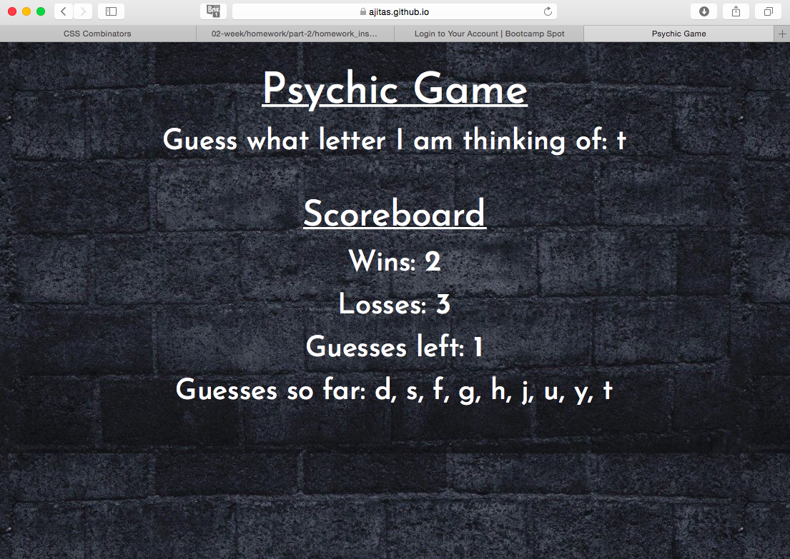

# Psychic-Game

<!-- Put a description of what the project is -->
Learning Vanilla Javascript: control structures, data structures, functions, event handling

## Link to deployed site
<!-- make a link to the deployed site --> 
<!-- [What the user will see](the link to the deployed site) -->
[psychic-game](https://ajitas.github.io/Psychic-Game/)

## Images
<!-- take a picture of the image and add it into the readme  -->
<!--  -->


## technology used
<!-- make a list of technology used -->
<!-- what you used for this web app, like html css -->

<!-- 
1. First ordered list item
2. Another item
⋅⋅* Unordered sub-list. 
1. Actual numbers don't matter, just that it's a number
⋅⋅1. Ordered sub-list
4. And another item. 
-->
1. HTML
2. CSS
3. Javascript
    * control structure(loops, conditions)
    * data structures
    * event handling
    * functions


## code snippets
<!-- put snippets of code inside ``` ``` so it will look like code -->
<!-- if you want to put blockquotes use a > -->

```
function printSoFarGuessed(key){
    if(document.getElementById("guesses").textContent == ""){
        //first letter without a ',' ahead of it
        document.getElementById("guesses").textContent = key;
    }
    else{
        //all the guesses letters separated by ','
        document.getElementById("guesses").textContent = document.getElementById("guesses").textContent  + ', ' + key;
    }
}

//call for setting up the game
resetGame();

document.onkeyup = function(event){
    //key has to be a letter not guessed so far
    if(event.keyCode >= 65 && event.keyCode <= 90 && arrayInputs.indexOf(event.key.toLowerCase()) == -1){
  
        //Show the currently guessed letter
        document.getElementById("input").textContent = event.key.toLowerCase();

        //Push the letter in array to print the so far guessed letters
        arrayInputs.push(event.key.toLowerCase());

        //Store the keycode [65-90] for a-z as userInput
        userInput = event.keyCode;

        //If there is a match
        if(userInput === comInput){

            //Increase the wins and print it
            wins++;
            document.getElementById("wins").textContent = wins;
            //Clear the screen for new game
            resetGame();
        }
        else{
            //Decrement the guesses left and print it
            guessesLeft--;
            document.getElementById("guessesleft").textContent = guessesLeft;

            //If no more chances of guessing left
            if(guessesLeft == 0)
            {
                //increment losses and print it
                losses++;
                document.getElementById("loses").textContent = losses;
                //Clear the screen for new game
                resetGame();
            }
            else{
                //Print so far guessed letters
                printSoFarGuessed(event.key.toLowerCase());  
            }
        }
    }
    else{
        //Invalid key-It has to be a letter that has not been guessed earlier in the current game
        if(event.keyCode<65 && event.keyCode>90){
            alert("Invalid input");
        }
    }
}
```
## Learning points
* How key events are handled in javascript
* How to use the event keys by logging it
* Script that uses DOM should not be run before DOM is loaded
* Returning functions


## Author 
[Ajita Srivastava](https://github.com/ajitas)

## License
Standard MIT License